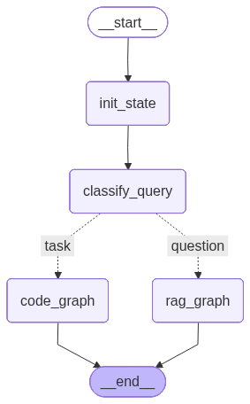

# NeuroML AI assistant

This repository contains multiple packages that together make up the NeuroML AI Assistant.
This is currently in active development.

The packages included, one in each folder are:

- neuroml_ai: top level application that makes use of the RAG and code assistant
- rag_pkg: a generic RAG implementation
- code_ai_pkg: NeuroML specific AI code assistant
- mcp_pkg: MCP server for NeuroML
- utils_pkg: common utility functions used by other packages

Please see the individual Readme files for more information.

## LangGraph schematic

