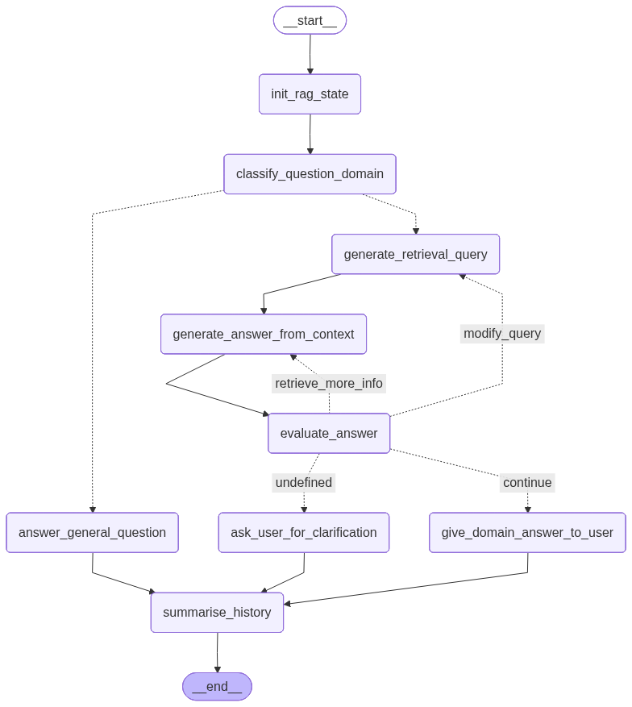

# General RAG implementation

This is a general RAG implementation for use in NeuroML (and other domains).
It implements a general LangChain/LangGraph graph for answering queries based on information stored in vector stores.
It includes:

- support for multiple domains (configurable, see below)
- vector store retrieval
- answer evaluation and iterative improvements
- a FastAPI chat end point
- a command line and Streamlit user interface

## Usage

Install the package and dependencies using `pip` or `uv pip` from the GitHub repository:

```
# in the `utils_pkg` folder:
pip install .

# in the `gen_rag` folder:
pip install .
```

Start the API server:

```
fastapi dev gen_rag/api/main.py --port 8005
```

The following environment variables need to be set:

- `GEN_RAG_CHAT_MODEL`: the name of the chat model to use. See below.
- `GEN_RAG_VS_CONFIG`: the path to the configuration file for the vector stores.

### Supported models

- local Ollama models: include the `ollama:` prefix.
- HuggingFace inference providers: include a `huggingface:` prefix. You must obtain a HuggingFace token and set it in the `HF_TOKEN` environment variable.
- other models supported by LangChain: set their particular environment variables (see the LangChain docs for more information)


Use the CLI to interact with the system:

```
nml-gen-rag --help
```

The swagger UI provided by FastAPI can also be used directly.
Note that no authentication has currently been implemented.

## Configuration

The RAG requires a JSON configuration file that sets up the domains and their vector stores.
Each domain can have multiple vector stores.
Please see the example `vector-stores.json` file provided.

Note that the vector stores can be placed anywhere and the path provided.
However, it is necessary that the same embedding model is used to populate the vector store, and then retrieve information from it.
This is provided in the JSON configuration file.


## LangGraph schematic


